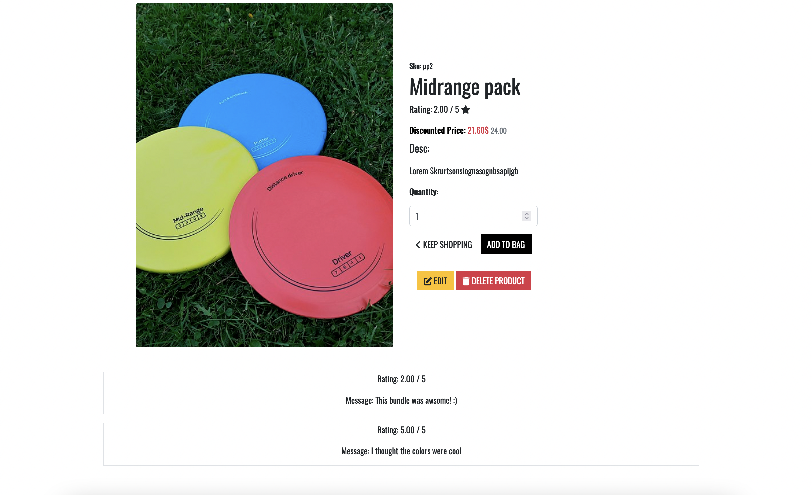

<h1>Pro Disc</h1>

### **Live Site**
[Pro Disc](https://ci-pp5-e-commerce.herokuapp.com/)

# About
This is a full-stack e-commerce project I build using Python, JavaScript, HTML and CSS.
I created this website for a friends business that sells golf discs.

# Content

[User Experience](#user-experience)

# Strategy
 The purpose of this project is to create a website that allows users to purschase products and the site owner to recive all orders. The target audience for theese products are.

 * Active people that enjoys nature.
 * Those who often play disc golf.
 * All ages, mostly men between 20-40.

 Thinking aout the main audience i think the most important things for this website to contain is the following:

* Easy to navigate and to sort for the type of disc your interested in buying.
* Has alot of trustability to make the user feel like they are buying from proffesionals that know what their talking about.
* Has social media links to Facebook, Instagram etc.
* User accounts to easily keep track of previous orders.
* Let users that bought a product rate it.

And the most important functionality for the site owner is the following:

* Ability to add, update and delete products. 
* Ability to add discounts to products.
* Allow users to contact the store owner incase they have any questions or if something is not working as expected.
* Look at customer reviews on products.

# User Stories

## User

1. As a shopper I want to be able to view all products so that I can browse the websites products.
2. As a shopper I want to be able to Sort products based on type of product so that I can find products based on what I want.
3. As a shopper I want to be able to sort products based on category so that i can find the best rated/priced products.
4. As a shopper I want to be able to add products to a cart so that i can save products im interested in.
5. As a shopper I want to be able to select a quantity of the product to add to the cart so that i can add more than one of the same product to my cart
6. As a shopper I want to be able to view the price of my entire cart so that i can be aware of how much it costs.
7. As a shopper I want to be able to update the quantity of a product in my cart so that i can easily make changes in my cart.
8. As a shopper I want to be able to delete products from my cart so that i can remove products i dont want to buy.
9. As a shopper I want to be able to easily checkout and enter my shipping details so that i can feel comftrable and safe when placing my order
10. As a shopper I want to be able to make a purchase using my debit/credit card so that i can pay for my order right away.
11. As a shopper I want to be able to recive a confirmation email so that i can feel safe that the order went through and keep record of my orders.
12. As a shopper I want to be able to easily contact the store so that i can ask them questions and get assistans if needed.
13. As a shopper I want to be able to read course reviews so that i can find new good courses to try out.
14. As a shopper I want to be able to sign up to a newsletter so that i can be the first one to hear about new arrivals and deals.
15. As a shopper I want to be able to register for an account so that i can see my previous orders and save my shipping details.
16. As a shopper I want to be able to login/logout so that i can Access my profile.
17. As a shopper I want to be able to recover my password if i forgot it so that i can recover my account.

## Site Owner

1. As a store owner I want to be able to add products so that I can add new products to my store
2. As a store owner I want to be able to edit already existing products so that I can manage products, ex. update images, price, description etc.
3. As a store owner I want to be able to delete products so that I can remove products i dont want to sell anymore.
4. As a store owner I want to be able to see customer reviews on products so that I can know if the product is appricated or not.
5. As a store owner I want to be able to send emails to customers that signed up to my newsletter so that i can notify them of any new arrivals or upcomming deals to increse sales.

# Scope

To achieve my user stories and thinking about the strategy the website will be created with the following functions:

## User
* Navigation thats shown on every page that contains the following:
    * A link back to the home page.
    * A search bar that lets the user search for specific products.
    * Links to the user profile and a cart that displays total price if its not empty.
    * Link to filter for diffrent types of products and links for deals, course reviews and contact
* A landin page that clearly demonstrates what the site is for.
* A product page that lists all products and can be filtered for best price, rating and name.
* Product details page that shows the products details and allows the user to add it to their cart.
* Registration/login functionality so that users can create and manage their account. Built using django allauth to make sure everything is secure.
* A user profile page so that users can save preferred shipping details and view past orders.
* A custom 404 page to let the users go back to the home page.
* A checkout page to let the users place orders safely and secure.
## Site owner
* Link in the nav to add new products.
* Links under the product details to edit and delete products.
* See customer reviews under the product details.

# Structure

The project structure looks like the following:

Users are greeted with a homepage that lets them know the purpose of the site right away. At the top of the page there is a clear navigation bar that allows the user to get fast access to whatever part of the website their most interested in. If the user scrolls down they can see our best rated prodcuts and below that there's a footer that lets the user sign up to our newsletter, view our social media platforms or get our contact information. Since not all users are going to have an account they can checkout either as a guest or create a personal profile to save past orders and their shipping details.

The website is made of the following apps:

* Home
* Products
* Profile
* Cart
* Checkout
* Course Reviews

# Database Design

## Category
The Category model contains all diffrent product categories and it's purpose is to allow users to filter for diffrent categories.

## Products
The Products model is makes it possible for the site owner to add products for sale on the site. Each product has a name, description, price, rating and image. The site owner can also add discounts to products to increse sales for that product.

## Order & OrderLineItems
The Order model holds all order details of an order placed by a user. The OrderLineItems model contains all products in said order. The two models are connected with each other to make this possible.

## Profile
The Profile model makes it possible for users to create an account that
contains all of the their past orders and their prefered shipping details to allow faster and easier checkouts in the future. This also improves the user experience. For this project i used djangos user model togehter with django allauth to make sure every users information is stored sercurly.

## Review 
The Review model lets users that bought a product rate it and leave a message for the site owner. The products rating changes based on user reviews.

## Course Reviews
The Course Reviews model is created to improve the SEO by linking to external websites and to make users visit the site more frequently and not only to make purchases. The model consists of a course name, author, text, address, rating and image. This model will also make the site more trustworthy.

# Marketing Strategies

## Business Plan
Pro Disc is a B2C business built and designed to sell disc golf discs, appropriate accesories and to create a fanbase of disc golf lovers. Before i started building this website I wrote a marketing plan which you can see below:

Theese are the questions I answered to decide how to market the business the best.

1. Who are your users?
    * All diffrent ages, mostly men but also women. Most of our users will have an active lifestyle, like all kind of diffrent sports and like to be outdoors.
2. Where can you find theese users?
    * Most of our users will be on social platforms such as facebook, instagram and twitter. they´ll follow people with an active lifestyle and people that post about sports.
3. What are your users needs? Are they looking for specific content and if so what type of content and can you provide it to them?
    * Most of our users will be intrested in playing the sport disc golf and a great way to help them visit the site more frequently would be to include course reviews so that there's more content than just buying discs.
4. Is your site going to run sales? When would be the best time to have theese campaigns?
    * Since Disc golf is a sport you play outdoors and mostly during the summer we will have sales start right before the summer and renew them throughout the whole summer.
5. How would your users hear about new products or new campaigns?
    * Most of our users would hear about it either from our newsletter or from any of our social media platforms. We also have plans to sign influencers and make them ambassadors for the website and having them post about us on their social media.

## Marketing platforms

### Newsletter
Users are able to sign up to our newsletter to be the first ones to hear about new products and campaigns

### Facebook

### Instagram

### Twitter

# Features

### Navigation
The nav bar consists of a logo, search bar, account link, cart link, dropdown menu to filter for diffrent type of products, link to deals page, link to course reviews page and a link to our contact page.

### Home Page

### Footer

The footer has the same colors as the navbar and features information about the company, our social media links, usefull links on the website and our contact information. The footer also contains a form where users can sign up to our newsletter.

### Deals Page

The Deals page displays all products that are have a discount.

### Course Reviews Page

The course reviews page shows all of our reviews and helps the user find new exciting courses to visit.

### Contact Page

The contact page contains all of our contact information

### Profile Page

The Profile page has a form on the left side that lets the user save their prefered shipping details, on the right side it displays all of the users past orders.

### Cart Page

The Cart page contains an overview of all of the items added by the user, the information is displayed in a table that contains a product info field, price field, quantity field and a subtotal field, the user can also change the quantity and update the table or they can delete a product from the table by clicking the "delete" button. If the cart is empty the user table is empty and the page contains the text "Your cart is empty." And shows the "Keep Shopping" button.

### Product Page

The Product page contains a sort select to filter the products price, rating and name.
The products are displayed side by side with an image, name, description, price and rating.

### Product Detail Page

The Products Detail page contains a link at the top witch lets the user know what product they are viewing and lets them go back to either the product page or the home page. 
The page is divided into two sides. The left side contains the product image and the right side contains the products sku, name, rating, price and description. Beneth this the user can select a quantity they wish to add to their bag and then by clickling the "Add to Cart" 

### Toasts

### Checkout Page

### Order Details Page

### Product Review Page

### Edit Product Page

### Add Product Page

### See Reviews

# Wireframes
To create the website design i used [Balsamiq](https://balsamiq.cloud) and to create the database diagram i used [Lucidchart](https://www.lucidchart.com)