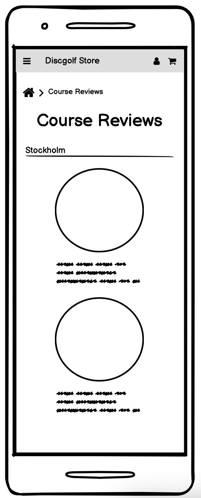
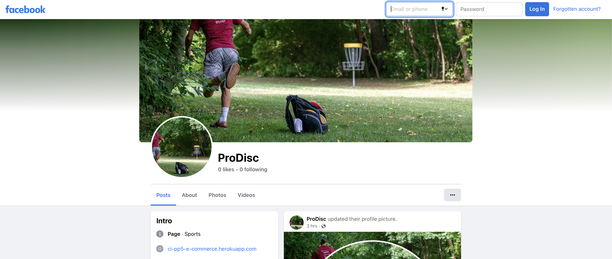

<h1>Pro Disc</h1>

### **Live Site**
[Pro Disc](https://ci-pp5-e-commerce.herokuapp.com/)

# About
This is a full-stack e-commerce project I build using Python, JavaScript, HTML and CSS.
I created this website for a friends business that sells golf discs.

# Strategy
 The purpose of this project is to create a website that allows users to purschase products and the site owner to recive all orders. The target audience for theese products are.

 * Active people that enjoys nature.
 * Those who often play disc golf.
 * All ages, mostly men between 20-40.

 Thinking aout the main audience i think the most important things for this website to contain is the following:

* Easy to navigate and to sort for the type of disc your interested in buying.
* Has alot of trustability to make the user feel like they are buying from proffesionals that know what their talking about.
* Has social media links to Facebook, Instagram etc.
* User accounts to easily keep track of previous orders.
* Let users that bought a product rate it.
* Look at customer reviews on products.

And the most important functionality for the site owner is the following:

* Ability to add, update and delete products. 
* Ability to add discounts to products.
* Allow users to contact the store owner incase they have any questions or if something is not working as expected.

# User Stories

## User

1. As a shopper I want to be able to view all products so that I can browse the websites products.
2. As a shopper I want to be able to Sort products based on type of product so that I can find products based on what I want.
3. As a shopper I want to be able to sort products based on category so that i can find the best rated/priced products.
4. As a shopper I want to be able to add products to a cart so that i can save products im interested in.
5. As a shopper I want to be able to select a quantity of the product to add to the cart so that i can add more than one of the same product to my cart
6. As a shopper I want to be able to view the price of my entire cart so that i can be aware of how much it costs.
7. As a shopper I want to be able to update the quantity of a product in my cart so that i can easily make changes in my cart.
8. As a shopper I want to be able to delete products from my cart so that i can remove products i dont want to buy.
9. As a shopper I want to be able to easily checkout and enter my shipping details so that i can feel comftrable and safe when placing my order
10. As a shopper I want to be able to make a purchase using my debit/credit card so that i can pay for my order right away.
11. As a shopper I want to be able to recive a confirmation email so that i can feel safe that the order went through and keep record of my orders.
12. As a shopper i want to be able to view an order confirmation so that i can verify that my order details are correct.
13. As a shopper I want to be able to easily contact the store so that i can ask them questions and get assistans if needed.
14. As a shopper I want to be able to read course reviews so that i can find new good courses to try out.
15. As a shopper I want to be able to sign up to a newsletter so that i can be the first one to hear about new arrivals and deals.
16. As a shopper I want to be able to register for an account so that i can see my previous orders and save my shipping details.
17. As a shopper I want to be able to login/logout so that i can Access my profile.
18. As a shopper I want to be able to recover my password if i forgot it so that i can recover my account.

## Site Owner

1. As a store owner I want to be able to add products so that I can add new products to my store
2. As a store owner I want to be able to edit already existing products so that I can manage products, ex. update images, price, description etc.
3. As a store owner I want to be able to delete products so that I can remove products i dont want to sell anymore.
4. As a store owner I want to be able to see customer reviews on products so that I can know if the product is appricated or not.
5. As a store owner I want to be able to send emails to customers that signed up to my newsletter so that i can notify them of any new arrivals or upcomming deals to increse sales.

# Scope

To achieve my user stories and thinking about the strategy the website will be created with the following functions:

## User
* Navigation thats shown on every page that contains the following:
    * A link back to the home page.
    * A search bar that lets the user search for specific products.
    * Links to the user profile and a cart that displays total price if its not empty.
    * Link to filter for diffrent types of products and links for deals, course reviews and contact
* A landin page that clearly demonstrates what the site is for.
* A product page that lists all products and can be filtered for best price, rating and name.
* Product details page that shows the products details and allows the user to add it to their cart.
* Registration/login functionality so that users can create and manage their account. Built using django allauth to make sure everything is secure.
* A user profile page so that users can save preferred shipping details and view past orders.
* A custom 404 page to let the users go back to the home page.
* A checkout page to let the users place orders safely and secure.
## Site owner
* Link in the nav to add new products.
* Links under the product details to edit and delete products.
* See customer reviews under the product details.

# Structure

The project structure looks like the following:

Users are greeted with a homepage that lets them know the purpose of the site right away. At the top of the page there is a clear navigation bar that allows the user to get fast access to whatever part of the website their most interested in. If the user scrolls down they can see our best rated prodcuts and below that there's a footer that lets the user sign up to our newsletter, view our social media platforms or get our contact information. Since not all users are going to have an account they can checkout either as a guest or create a personal profile to save past orders and their shipping details.

The website is made of the following apps:

* Home
* Products
* Profile
* Cart
* Checkout
* Course Reviews

# Database Design

## Category
The Category model contains all diffrent product categories and it's purpose is to allow users to filter for diffrent categories.

## Products
The Products model is makes it possible for the site owner to add products for sale on the site. Each product has a name, description, price, rating and image. The site owner can also add discounts to products to increse sales for that product.

## Order & OrderLineItems
The Order model holds all order details of an order placed by a user. The OrderLineItems model contains all products in said order. The two models are connected with each other to make this possible.

## Profile
The Profile model makes it possible for users to create an account that
contains all of the their past orders and their prefered shipping details to allow faster and easier checkouts in the future. This also improves the user experience. For this project i used djangos user model togehter with django allauth to make sure every users information is stored sercurly.

## Review 
The Review model lets users that bought a product rate it and leave a message for the site owner. The products rating changes based on user reviews.

## Course Reviews
The Course Reviews model is created to improve the SEO by linking to external websites and to make users visit the site more frequently and not only to make purchases. The model consists of a course name, author, text, address, rating and image. This model will also make the site more trustworthy.

# Wireframes
All Wireframes were created using [Balsamiq](https://balsamiq.cloud/)

### Home Page

### Products Page

### Product Detail Page

### Course Reviews

# Marketing Strategies

## Business Plan
Pro Disc is a B2C business built and designed to sell disc golf discs, appropriate accesories and to create a fanbase of disc golf lovers. Before i started building this website I wrote a marketing plan which you can see below:

Theese are the questions I answered to decide how to market the business the best.

1. Who are your users?
    * All diffrent ages, mostly men but also women. Most of our users will have an active lifestyle, like all kind of diffrent sports and like to be outdoors.
2. Where can you find theese users?
    * Most of our users will be on social platforms such as facebook, instagram and twitter. they´ll follow people with an active lifestyle and people that post about sports.
3. What are your users needs? Are they looking for specific content and if so what type of content and can you provide it to them?
    * Most of our users will be intrested in playing the sport disc golf and a great way to help them visit the site more frequently would be to include course reviews so that there's more content than just buying discs.
4. Is your site going to run sales? When would be the best time to have theese campaigns?
    * Since Disc golf is a sport you play outdoors and mostly during the summer we will have sales start right before the summer and renew them throughout the whole summer.
5. How would your users hear about new products or new campaigns?
    * Most of our users would hear about it either from our newsletter or from any of our social media platforms. We also have plans to sign influencers and make them ambassadors for the website and having them post about us on their social media.

## Marketing platforms

### Newsletter
Users are able to sign up to our newsletter to be the first ones to hear about new products and campaigns

### Facebook

The site has its own facebook page witch will be one of our main marketing platforms.

## SEO

I used [soovle](https://soovle.com) to find good keywords to use throughout the website. I then googled theese words to see what type of websites that were showing up. As expected alot of stores and courses were showing up so i knew i had a few good keywords such as Disc Golf, Disc Golf Lovers, Putt & approach and a few more.

The site has been equipped with a sitemap generated by [xml-sitemaps](https://www.xml-sitemaps.com/) and a robots.txt file.

# Features

### Navigation
The nav bar consists of a logo, search bar, account link, cart link, dropdown menu to filter for diffrent type of products, link to deals page, link to course reviews page and a link to our contact page.

### Home Page

### Footer

The footer has the same colors as the navbar and features information about the company, our social media links, usefull links on the website and our contact information. The footer also contains a form where users can sign up to our newsletter.

### Deals Page

The Deals page displays all products that are have a discount.

### Course Reviews Page

The course reviews page shows all of our reviews and helps the user find new exciting courses to visit.

### Contact Page

The contact page contains all of our contact information

### Profile Page

The Profile page has a form on the left side that lets the user save their prefered shipping details, on the right side it displays all of the users past orders.

### Cart Page

The Cart page contains an overview of all of the items added by the user, the information is displayed in a table that contains a product info field, price field, quantity field and a subtotal field, the user can also change the quantity and update the table or they can delete a product from the table by clicking the "delete" button. If the cart is empty the user table is empty and the page contains the text "Your cart is empty." And shows the "Keep Shopping" button.

### Product Page

The Product page contains a sort select to filter the products price, rating and name.
The products are displayed side by side with an image, name, description, price and rating.

### Product Detail Page

The Products Detail page contains a link at the top witch lets the user know what product they are viewing and lets them go back to either the product page or the home page. 
The page is divided into two sides. The left side contains the product image and the right side contains the products sku, name, rating, price and description. Beneth this the user can select a quantity they wish to add to their bag and then by clickling the "Add to Bag" button the selected quantity is added to their cart. Under the "Add to Bag" button other customers reviews are shown.

### Toasts

To make the user aware of what their doing most of the functions a user can do shows a toast containing relevant information about what they just did. Ex. Added product to your cart or updated quantity to...

### Checkout Page

The checkout Page contains of a form on the left side where the user can enter their personal details and their shipping details before adding their card details and completing the order. On the right side there's a order summary witch shows all products the user is about to order and the grand total.

#### Testing
 * When Testing the checkout page use card number, 4242 4242 4242 4242
 * Use a valid future date
 * Use any three-digit CVC

### Order Details Page

The Order Details page displays the order number, order information and shipping information. The page also contains links to rate each product they bought.

### Product Review Page

The Product Review page lets the user rate each product they bought from zero to five witch will then update the products rating. The user can also leave a message witch for now only the store owners can see.

### Edit Product Page

The Edit Product page contains of a form where the store owners can edit a page. ex. Add a discount to it.

### Add Product Page

The Add Product page looks the same as the edit product page except the form is empty and the store owner can add information about the new product their about to add

### Error Pages

This page will be shown to users that visit a url that doesnt exsist and will make them able to go back to the home page.

# Technologies Used

I have used several technologies that have enabled this design to work:

### Django
* Django is the framework that has been used to build the project and its apps.
### Python
* Python is the core programming language used to write all of the core functions in this application to make it fully functional.
### Bootstrap
* Used for creating responsive design.
### Google Fonts
* Used to obtain the font used on the website.
### Font Awesome
* Used to obtain all icons used for this project.
### Google Developer Tools
* Used as a primary method of fixing spacing issues, finding bugs, and testing responsiveness across the project.
### GitHub
* Used to store code for the project after being pushed.
### Git
* Used for version control by utilising the Gitpod terminal to commit to Git and Push to GitHub.
### Gitpod
* Used as the development environment.
### Heroku
* Used to deploy my application.
### Lucidchart
* Used to create the database schema for the project.
### Balsamiq
* Used to create the the UI.
### Pep8
* Used to test my code for any issues or errors.
### W3C Markup Validation Service
* Used to validate all HTML code written.
### W3C CSS Validation Service
* Used to validate all CSS code written.
### JSHint
* Used to validate JS code
### Techsini
* Used to generate responsive image used in README file.
### SQLite
* I have SQLite to run my database tests locally.
### PostgreSQL
* I have used Heroku's PostgreSQL relational database in deployment to store the data for my models.
### AWS
* I used Amazon AWS S3 to store all of my static and media files.

# Testing
 [Testing can be found here](https://github.com/FilipWirsen/pp5-ci/tree/main/docs/testing/TESTING.md)

# Deployment 

## Forking the GitHub Repository
To fork or make a clone of this repository, follow theese steps:

1. Access your Github account and find the relevant repository.
2. Click on 'Fork' on the top right of the pgae.
3. You will find a copy of the repository in your own GitHub account.

## Making a Local Clone
1. Access your Github account and find the relevant repository.
2. Click the 'Code' button next to 'Add file'.
3. Clone the repository by using HTTPS, under clone with HTTPS, copy the link.
4. Open Git Bash.
5. Access the directory you want the clone to have
6. In your IDE's terminal type 'git clone' and paste the URL you copied, press enter.
8. You now have a local clone!.

## Stripe
In order to take payments for the online store I implemented Stripe, you first have to create an account with them and then using the [documentation](https://stripe.com/docs) add the relevant HTML, Python and JavaScript code suitible for your project needs.

## AWS Static and Media Storage
All static and media files are stored in the cloud using Amazon AWS S3. I created a bucket, user group and user that can access this site and the relevant files. In order for the files to be correctly served the following setting have to be added to your settings.py file in your project directory:

## Gmail SMTP
To send confirmation emails and all Allauth related email when the deployed version is used I used the following documentation to set it up and added theese settings to my settings.py file:

## Heroku
### In your app
1. Add the list of requirements by using the terminal and typing 'pip3 freeze > requirements.txt'
2. Git add, commit and push to commit and push your new changes. 

### Log into heroku
3. Log into Heroku or create a new account.
4. In the top right corner click, 'New' and choose the option 'Create new app'. If you are a new user the 'Create new app' button will appear in the middle of the screen.
5. Choose your app name, it has to be unique and cannot be the same as this projects name.
6. Choose the region closest to you. 
7. Click 'Create app'.
### Inside your new app page
8. Go to the 'Resources' Tab, Add-ons, search and add Heroku Postgres.
9. Choose 'Settings' from the menu on the top of the page.
10. Go to the section 'Config Vars' and click on the button 'Revel Config Vars'.
11. Add all variables neccesary for your project, for mine its the following:
* AWS_ACCESS_KEY_ID
* AWS_SECRET_ACCESS_KEY
* DATABASE_URL
* EMAIL_HOST_PASS
* EMAIL_HOST_USER
* SECRET_KEY, generated via [Secret Key Generator](https://djecrety.ir/)
* STRIPE_PUBLIC_KEY
* STRIPE_SECRET_KEY
* STRIPE_WH_SECRET
* USE_AWS
### Go Back to Your Code
12. Now you need to create a Procfile in the root directory of your project. Its important that the P is in uppercase.
13. In your newly created Procfile add the following:
* web: gunicorn PROJECT_NAME.wsgi
14. In settings.py add Heroku to allowed hosts.
### Final steps
15. Go to the 'Deploy' tab in Heroku
16. Under the section 'Deployment method' choose 'GitHub'
17. A new section will appear. 'Connect to GitHub', search for the repository name you want to connect to.
18. Once Heroku finds the repository, click 'connect'
19. Scroll down to the section 'Automatic Deploys'.
20. Click 'Enable automatic deploys' or choose 'Deploy branch' and manually deploy.
21. Click 'Deploy branch'.
22. Once the program runs you should see the following message:
* 'The app was successfully deployed'
23. Click the button 'View'.

# Credits
The project walkthrough Boutique Ado from Code Institute original repo.
The structure of this readme has been influenced by alot of diffrent readme files but the one that stuck out the most and i really liked was by SamanthaBooth81 for their Project 5.
Withour [Stack overflow](https://stackoverflow.com/) i would never have been able to complete this project. Now that i've studied full stack development for a while im getting more and more comfortable with knowing what i should search for to get the best results and once I figured that out stack overflow is a really good weapon to have in your arsenal.

# Acknowledgements
I want to thank my mentor Akshat for pointing me in the right direction and Code Institutes awsome Tutors for their patience and putting up with me even though im really stupid at times.
